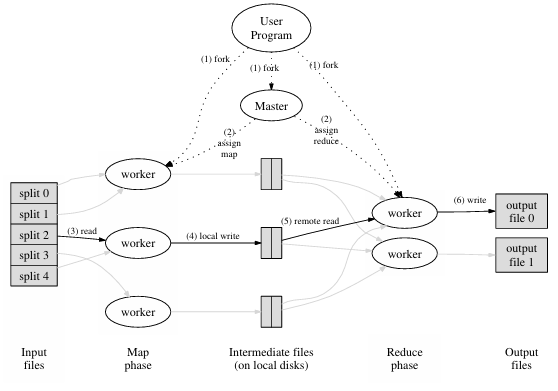
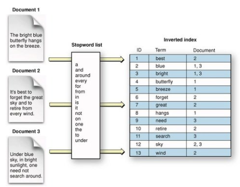

# Multithread Map-Reduce Inverted Index

<p align="center">
    
</p>

## Overview

This project implements a *parallel inverted index* using the **Map-Reduce** paradigm inspired by Google's MapReduce framework, implemented with **Pthreads**. Given a set of input text files, the program extracts unique words, determines which files contain them, and outputs a structured index for efficient word lookups.

## Performance

Running with 4 Mapper threads (M=4) and 4 Reducer threads (R=4):
- Execution time: 0.39 seconds
- Speedup: 3.03x

## Features

- Implements **Map-Reduce** for parallel word indexing

- Uses **Pthreads** for parallelization

- Outputs results in *sorted files* categorized alphabetically

- Supports *dynamic workload distribution* for efficiency

- Compatible with **Docker** for easy testing and deployment

## How it works



1. **Mapper Phase**:

    - Reads assigned files

    - Extracts words and converts them to lowercase

    - Outputs *{word, file_ID}* pairs

2. **Reducer Phase**:

    - Aggregates *{word, {file_IDs}}* entries

    - Groups words by their starting letter

    - Sorts words by frequency across files

3. **Output**:

    - Generates one file per alphabet letter (a.txt, b.txt, etc.)

    - Words inside each file are sorted by *frequency* (descending)

    - If multiple words have the same frequency, they are sorted *alphabetically*

## Usage

1. Compile using Makefile:

    ```bash
    make
    ```

2. Run the program:

    ```bash
    ./map_reduce <Map_num_threads> <Reduce_num_threads> <input_file>
    ```

    - `Map_num_threads`: Number of threads for the **Mapper** phase
    - `Reduce_num_threads`: Number of threads for the **Reducer** phase
    - `input_file`: Path to the input file containing the list of text files to index

## Example

- To run the program with 2 **Mapper** threads, 3 **Reducer** threads, and the input file `input.txt`:
    ```bash
    ./map_reduce 2 3 input.txt
    ```

- Where `input.txt` contains the following:

    ```text
    3
    file1.txt
    file2.txt
    file3.txt
    ```

- The program will output the inverted index in the following format:

    - `a.txt`
        ```text
        and:[2]
        are:[1]
        as:[1]
        ```

    - `b.txt`
        ```text
        blue:[1 2]
        birds:[1]
        bright:[1]
        brightly:[3]
        by:[2]
        ```

## References

- [Google MapReduce: Simplified Data Processing on Large Clusters](https://static.googleusercontent.com/media/research.google.com/en//archive/mapreduce-osdi04.pdf)
- [Pthreads](https://computing.llnl.gov/tutorials/pthreads/)
- [Assigment 1: Map-Reduce Inverted Index](./README_assignment.pdf)